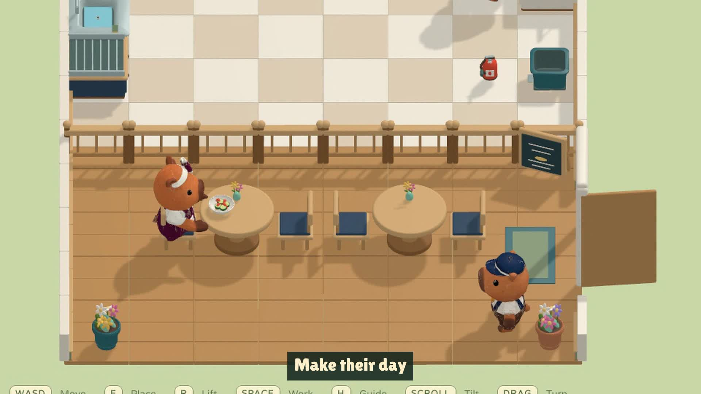
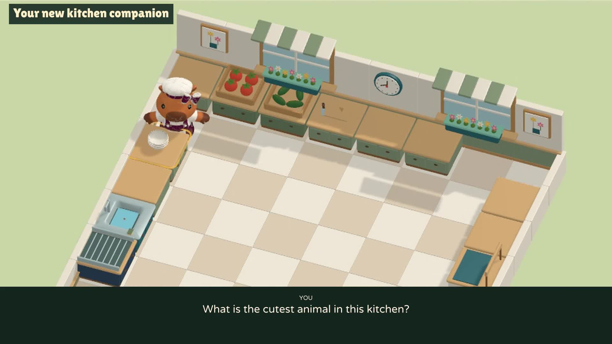

# Bara Kitchen


**Little paws. Big appetites.** A single-player 3D animal café: chop, combine, cook, serve, wash, and find your rhythm through four increasingly intricate kitchens. Built in Unity, with capybara, cat and dog chefs and a café full of animal customers.

[Watch / download the trailer](https://github.com/codersusu/game-overcooked/releases/download/v0.1.0/Bara-Kitchen-Trailer.mp4) · [Download the demo](https://github.com/codersusu/game-overcooked/releases/tag/v0.2.0) · [Game design](docs/GAME_DESIGN.md) · [Implementation](docs/IMPLEMENTATION.md) · [Changelog](docs/CHANGELOG.md) · [Prompt summary](docs/PROMPT_SUMMARY.md)

[](https://github.com/codersusu/game-overcooked/releases/download/v0.1.0/Bara-Kitchen-Trailer.mp4)

## Play the demo

- **[macOS / Apple silicon ZIP](https://github.com/codersusu/game-overcooked/releases/download/v0.2.0/Bara-Kitchen-v0.2.0-macOS-AppleSilicon.zip)** — extract and open **Bara Kitchen.app**. This developer build is not notarized; macOS may require an explicit Open approval in Privacy & Security. Intel Mac and Windows native builds are not included.
- **[Desktop browser ZIP](https://github.com/codersusu/game-overcooked/releases/download/v0.2.0/Bara-Kitchen-v0.2.0-Web.zip)** — extract, run `python3 -m http.server 8000` inside `Bara-Kitchen-Web`, then open `http://localhost:8000`. Do not open the HTML as a `file://` URL. Use a WebGL-capable desktop browser; touch controls are not implemented.

The cooking game works locally without accounts, online services or AI API keys. Optional **AI chat** uses your own OpenAI API key through a private local helper. All four kitchens are available. An untimed first order introduces each kitchen; delivery starts the timed round. Calm mode gives longer round and order timers. Best scores and preferences are saved on the device.

| Action | Control |
|---|---|
| Move | WASD / arrow keys, relative to camera |
| Pick up, place, combine, serve | E |
| Chop, wash, extinguish | Tap Space once; moving cancels |
| Lift a portion off a plate | R with empty paws |
| Dash / throw ingredient | Shift from kitchen 2 / Q from kitchen 3 |
| Turn camera | Drag left/right, or comma / period |
| Tilt camera / reset view | Scroll, or [ / ]; C resets |
| Picture guide / pause | H / Escape |
| Start / end live voice chat | V / AI chat button |

After extinguishing a fire, carry the burnt pot to the bin, empty it with E, then return the pot to the stove before cooking again.

## Chat with Bara while playing

Click **AI chat** or press **V**. On first use, enter **your own OpenAI key** in the masked popup, choose **Connect & chat**, allow microphone access, and talk naturally with Bara’s soft, bright, playful voice. Click **End chat** or press V again to stop. The kitchen keeps running; you can move, cook and interrupt Bara while chatting. There is no typing or conversation panel.

Bara can explain the next cooking step, give directions relative to your current camera, and discuss your actual score, deliveries, misses and streak. While chat is on, it gives occasional reminders for an unattended warning/burning pot, a nearly overdue dish in your paws, or a longer idle period. It offers brief encouragement after real progress. Say “no hints” to silence automatic reminders. A small blue marker can identify the suggested station. Bara gives advice and never performs game actions.

Start the included **Voice Helper** first. On Mac, open **Start Voice Helper.command** in the downloaded helper folder (or `scripts/voice/start_helper.command` in a repository checkout). For a repository checkout or manual setup (Python 3.9+):

```sh
python3 -m venv .local/voice-venv
.local/voice-venv/bin/pip install -r scripts/voice/requirements.txt
.local/voice-venv/bin/python scripts/voice/live_chef_server.py --player-keys-only
```

Keep the helper open while playing. Both ZIPs include a separate `Bara-Kitchen-Voice-Helper` folder; no key file or developer key is included. Enter the key in the game instead. It stays only in memory until quitting or **Settings → Voice setup → Forget key**. The popup briefly pauses gameplay while entering credentials; conversation itself does not pause it. The launcher ignores environment keys. Access to **gpt-live-1** is required. The private helper listens on `127.0.0.1:54115`; it forwards that player’s credential only to OpenAI.

Microphone audio streams to OpenAI **only while chat is on**, alongside kitchen context for guidance. The helper does not save audio or conversations. Closing chat or leaving the game stops the microphone. Sessions also end after 15 minutes or a lost game heartbeat. API usage is billed to your key: GPT-Live currently costs $0.05 per connected minute, plus delegated reasoning. This prototype runs voice through the player’s local helper; no hosted voice service is included. [Official GPT-Live model details](https://developers.openai.com/api/docs/models/gpt-live-1).

[](https://github.com/codersusu/game-overcooked/releases/download/v0.2.0/Bara-Kitchen-Voice-Trailer.mp4)

[Watch the live voice trailer](https://github.com/codersusu/game-overcooked/releases/download/v0.2.0/Bara-Kitchen-Voice-Trailer.mp4): real gameplay and GPT-Live replies, with synthetic player questions, edited pauses, captions and game music. It closes with Bara’s playful answer to “What is the cutest animal in this kitchen?”

## What is here

Four kitchens, two recipes, four ingredients, six selectable chef looks and six customer looks. Ingredients can be placed freely on plates and worktops. Only exact prepared combinations become dishes. Dishes circulate through service, customers, return and washing. Customers arrive, sit, eat and leave. Cooking has ready, warning, burning and extinguished states. Compact order tickets, score, timers, settings and results are native Unity UI.


These are screenshots from the playable build. The current character rig can still crease at sleeves and elbows; final animation contact, performance/download optimization, and human difficulty testing remain. Contextual spoken help is now available in English and Chinese. A helper that performs cooking tasks, voice task assignment, multiplayer and upgrades remain future ideas.

## Continue development

```sh
git clone https://github.com/codersusu/game-overcooked.git
cd game-overcooked
git lfs install
git lfs pull
```

Add **`Unity/BaraKitchen`** in Unity Hub with **6000.6.0f1**. Open **`Assets/BaraKitchen/Scenes/BaraKitchen_Game.unity`**, then press Play. Install the Web build-support module to rebuild the browser demo. Source, scenes, prefabs, textures, audio and exported builds are included; Unity's Library cache is excluded. Large binary files use Git LFS. GitHub source ZIP downloads may not contain the expanded LFS files; use the release downloads to play.

To open the existing browser build and art galleries locally:

```sh
python3 -m http.server 54114 --directory art
```

Open `http://localhost:54114/production/gameplay-round-01/`. Detailed build and verification commands are in [Implementation](docs/IMPLEMENTATION.md).

| Content | Location |
|---|---|
| Unity project / runtime source | [Unity/BaraKitchen](Unity/BaraKitchen) / [Gameplay](Unity/BaraKitchen/Assets/BaraKitchen/Gameplay) |
| Approved character reference / wardrobe sheets | [C1](art/approved/capybara-c1.png) / [roster round 2](art/concepts/roster-round-02) |
| Food concepts / approved floor plans | [kitchen concepts](art/concepts/kitchen-round-01) / [level round 2](art/concepts/levels-round-02) |
| Original 3D characters, props and rooms | [production assets](art/production/round-01) |
| Shared animation reviews | [animation gallery](art/production/animations-round-01) |
| Audio sources and provenance | [audio](art/audio) / [credits](docs/IMPLEMENTATION.md#audio-and-third-party-materials) |
| New icon / trailer and editable source | [brand](art/brand/round-01) / [trailer](art/trailers/round-01) |
| Playable ZIPs / verification evidence | [downloads](art/downloads) / [QA](art/production/gameplay-round-01/qa/full-playthrough) |

HTML galleries need the local server; GitHub displays their source. The trailer folder retains the captured clips, title composition and edit timeline for future recuts.

**Validation:** the original 0.1.0 handoff passed all four full-round keyboard playthroughs, serving 10 meals in total and checking dish reuse, expiry, results and retry. The current native suite passed 912 assertions, including cleanup and pot reuse in kitchens 2–4. A focused 0.1.1 keyboard playtest also passed the bin trip, a fresh soup delivery and restart. [Saved validation](art/production/gameplay-round-01/release-validation.json).

## Development record and usage

Measured through the completed **v0.1.1** cleanup update (commit `949aea3`), excluding the timing audit and subsequent voice-help development:

| Time measure | Recorded result |
|---|---:|
| Overall elapsed creation time | **6 days, 2 hours, 16 minutes, 54 seconds** |
| Active development — recorded assistant runtime | **7 hours, 23 minutes, 37 seconds** (7.39 hours) |
| Completed work turns / dates with recorded work | **37 turns / 3 dates** |

The period runs from **8 September 2026, 12:50:06 CEST** to **14 September 2026, 15:07:00 CEST**. Active time is the sum of completed-turn durations recorded by the session runtime, excluding gaps between turns. It includes game design/research, learning discussion, art generation, coding, tests, builds, documentation, trailers, uploads and tool waits within those turns. It is not a measure of human labor or pure model/CPU/GPU processing time; offline user work is not recorded.

| Work date (Europe/Berlin) | Completed turns | Active time |
|---|---:|---:|
| 8 September | 21 | 1h 17m 56s |
| 13 September | 8 | 2h 59m 22s |
| 14 September | 8 | 3h 06m 19s |

[Timing totals and method](docs/development-metrics.json) · [Sanitized per-turn evidence](docs/development-time-turns.json). Durations above are rounded to the nearest second. Git history starts with the consolidated handoff, so the first commit alone does not establish the development start; earlier milestones are in the [changelog](docs/CHANGELOG.md).

The available conversation usage checkpoint is **2026-09-14T11:46:40.807Z**. Model recorded: **gpt-6-astra**.

| Recorded category | Tokens |
|---|---:|
| Input, including cached input | 74,939,314 |
| Cached input, included above | 72,617,472 |
| Uncached input, calculated difference | 2,321,842 |
| Output, including reasoning output | 545,024 |
| Reasoning output, included above | 198,763 |
| Cache-write input | 0 |
| Total input + output | 75,484,338 |

Input totals count repeated conversation context across requests. Do not add cached input or reasoning output again. These counters cover the recorded checkpoint, **not all later work on the release**. [Machine-readable record](docs/development-metrics.json). Currency cost cannot be stated reliably without the account's billing/rate records. The documented main Meshy production batch used **385 credits**; initial experiments and ElevenLabs/image-generation charges are not fully reconciled, so no combined cost is invented.
