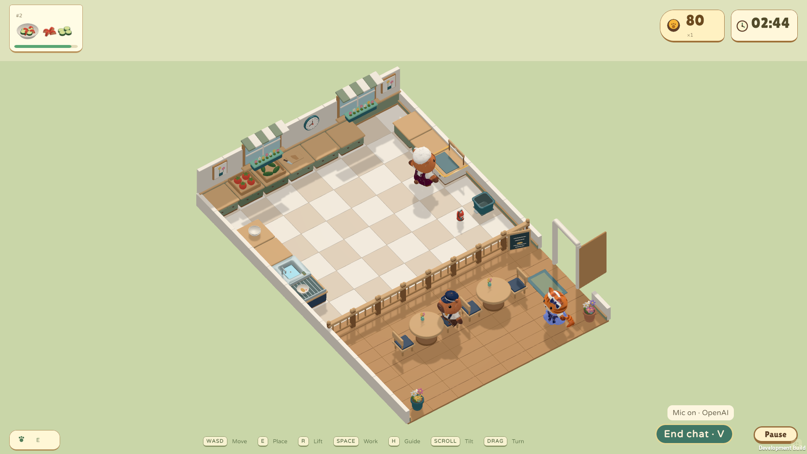
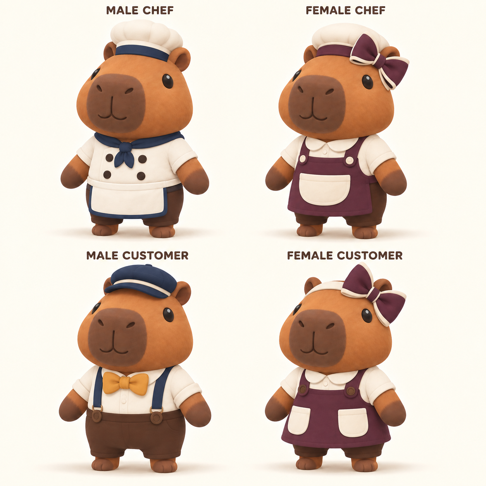
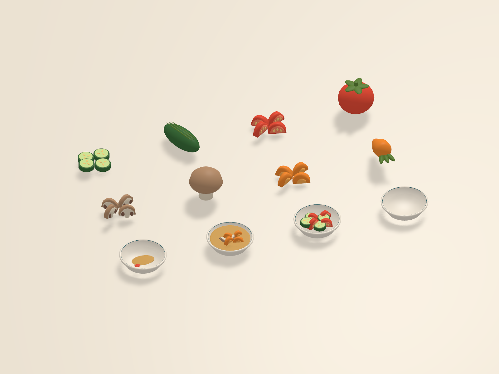
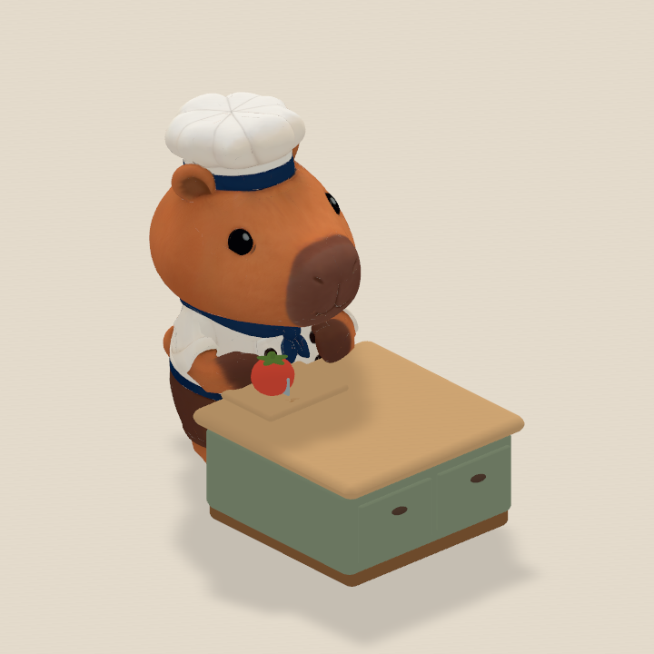
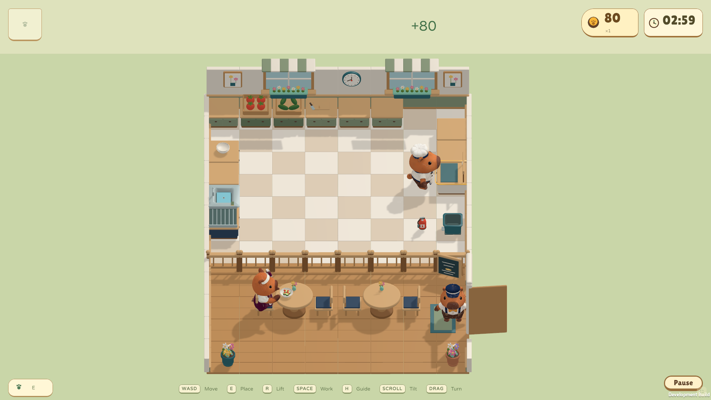
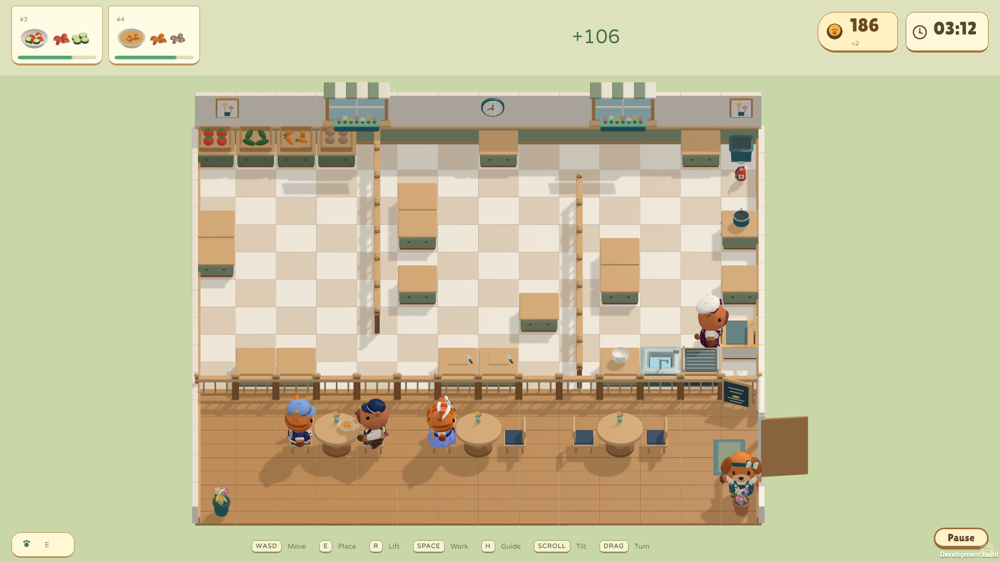
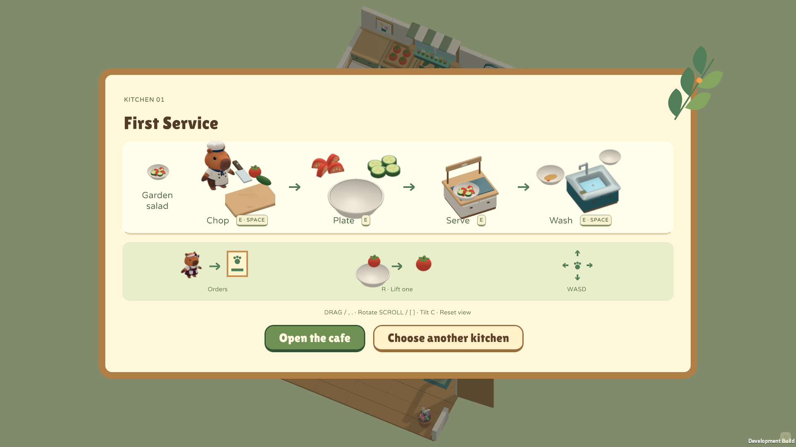
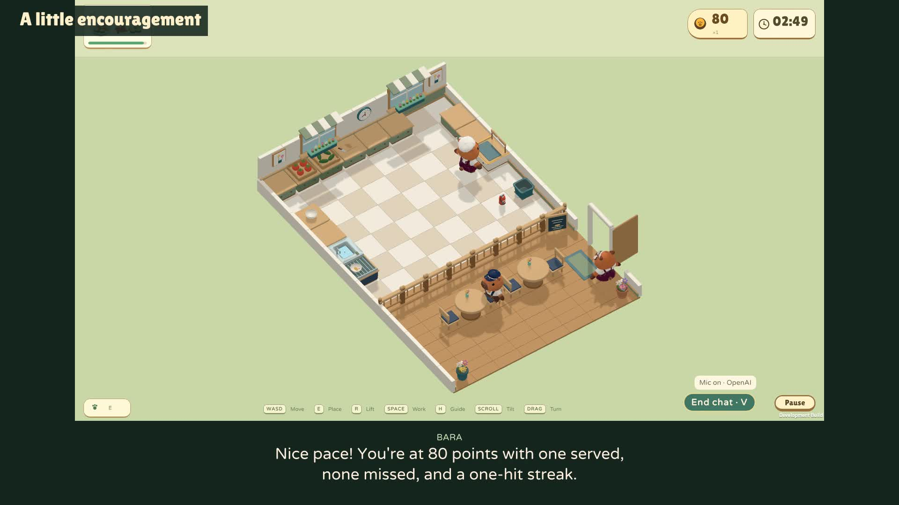

# Bara Kitchen — showcase submission

Little paws. Big appetites. A cozy cooking game with a capybara you can talk to while you play.

Run a tiny animal café as a capybara, cat or dog. Chop vegetables, combine salads, simmer soup, serve guests and keep clean plates moving through four distinct kitchens. Low barriers create ingredient-throwing shortcuts, and an unattended pot can turn a calm service into a little kitchen chaos.

Bara is also an optional live voice companion. Ask what to do next, talk about your progress or enjoy a little café banter while you keep cooking. Answers use the actual kitchen state, and occasional reminders help with forgotten pots. Built through an iterative conversation with Codex, from character concepts and 3D assets to animation, gameplay, playtests and trailers.

Format reference: [Void Explorer](https://developers.openai.com/showcase/void-explorer). Prepared for the [official submission form](https://openai.com/form/showcase-submission/) as checked on 2026-09-15. Submission preparation; not submitted to OpenAI.

## Suggested cover

Recommended cover · actual Unity gameplay, with live chat active.

## Build process

These are short, reconstructed prompts distilled from the creator's requests and accepted feedback. They describe the main stages, not verbatim transcripts or a claim that each stage took one prompt. Use earlier approved outputs as references for later steps.

### 1. Find the animal style

Start with a face and proportions worth keeping.

*Concept art — Approved capybara wardrobe direction, based on the C1 proportions.*

> Design a cozy animal cooking game called Bara Kitchen, with a capybara as the default chef. Explore a few cute directions with a big rounded head, short muzzle, dark animal eyes, tiny connected legs and simple paws. Refine the chosen version into a slightly slimmer body. Use that design as the standard for cats and dogs, with clearly different chef and customer outfits and visible accessories.

Result: The approved C1 direction became a shared character standard and wardrobe reference.

Supporting artifacts: [capybara-c1.png](https://github.com/codersusu/game-overcooked/blob/main/art/approved/capybara-c1.png) · [roster-round-02](https://github.com/codersusu/game-overcooked/tree/main/art/concepts/roster-round-02/)

### 2. Build a reusable kitchen kit

Turn the approved art into a small, consistent 3D world.

*Unity asset review — Reusable 3D food kit in Unity: four ingredients, two recipes and one serving vessel.*

> Use the approved animal references to create the 3D cast, trying image-to-3D for the characters where useful. Build a matching kit of vegetables, dishes, tools, counters and café furniture. We need whole and chopped tomato, cucumber, carrot and mushroom, plus salad and soup. Keep one serving vessel at a consistent scale. Use warm wood, sage cabinets, soft surfaces and flowers, with worktops at paw height below the animals' heads.

Result: Meshy character assets and reusable food and environment models were integrated into Unity.

Supporting artifacts: [kitchen-round-01](https://github.com/codersusu/game-overcooked/tree/main/art/concepts/kitchen-round-01/) · [round-01](https://github.com/codersusu/game-overcooked/tree/main/art/production/round-01/)

### 3. Make the little paws move

Review the action itself, then refine it across the cast.

*Animation review still — Animation review at paw-height worktops. Open the linked clip to inspect the movement.*

> Animate the chef walking, dashing, carrying, throwing, chopping, washing and putting out a fire. Feet should visibly step, and idle should gently lift the arms along the sides. Keep the head upright while chopping with a vertical knife. Make washing a small stroke at the plate rim. Add seated idle and eating for customers. Watch the clips on each animal and fix sleeve intersections, exaggerated motion and misplaced tools.

Result: A shared motion set was reviewed across the capybara, cat and dog presets.

Supporting artifacts: [chop.mp4](https://github.com/codersusu/game-overcooked/blob/main/art/production/animations-round-01/chop.mp4) · [animations-round-01](https://github.com/codersusu/game-overcooked/tree/main/art/production/animations-round-01/)

### 4. Connect one complete service

Make collecting, preparing, serving and cleaning work together.

*Gameplay screenshot — The first completed salad starts service; the guest eats in the adjoining café.*

> Build a playable single-player loop: collect vegetables, chop, assemble a salad or cook soup, serve a guest and wash the returned dish. Combine salad ingredients on any free counter; we do not need a salad station. Let raw and prepared food sit freely on plates, with only correct combinations becoming recipes. Tap once to work and move to cancel. An ignored pot should warn, burn and leave rubbish after extinguishing, requiring a trip to the bin.

Result: Food state, recipe matching, finite dishes, customers and fire recovery form one continuous loop.

Supporting artifacts: [GAME_DESIGN.md](https://github.com/codersusu/game-overcooked/blob/main/docs/GAME_DESIGN.md) · [Gameplay](https://github.com/codersusu/game-overcooked/tree/main/Unity/BaraKitchen/Assets/BaraKitchen/Gameplay/)

### 5. Give each kitchen a new rhythm

Change the routes, not just the difficulty number.

*Gameplay screenshot — Kitchen four combines prep, cooking and throwing routes across three work areas.*

> Draw four distinct kitchens before expanding the demo. Start with an open salad kitchen, then introduce soup and dashing around an island. Add low barriers that block walking but allow ingredients to be thrown across, then combine everything in a zigzag layout. Provide several empty worktops and a walking route to every station so one player can do everything. Give each kitchen a nearby dining area where animals arrive, sit, eat and leave.

Result: Four kitchens introduce preparation, cooking, dashing and throws through different spatial problems.

Supporting artifacts: [levels-round-02](https://github.com/codersusu/game-overcooked/tree/main/art/concepts/levels-round-02/) · [full-playthrough](https://github.com/codersusu/game-overcooked/tree/main/art/production/gameplay-round-01/qa/full-playthrough/)

### 6. Let the café fill the screen

Make the game readable, colorful and pleasant to handle.

*Gameplay screenshot — A short picture guide teaches the loop without filling service with text popups.*

> Make the UI belong to this café: compact recipe tickets, patience bars, score and a round timer. Let the kitchen and dining area fill most of the screen. Replace large instructional popups with a simple picture guide and small progress bars over pots. Preserve bright model colors, soft shadows and clean edges. Add cooking sounds, music and cute guest reactions. Let players turn and tilt the camera to keep the action visible.

Result: Café-themed UI, picture tutorials, sound and adjustable camera framing support exploration.

Supporting artifacts: [GAME_DESIGN.md](https://github.com/codersusu/game-overcooked/blob/main/docs/GAME_DESIGN.md) · [gameplay-round-01](https://github.com/codersusu/game-overcooked/tree/main/art/production/gameplay-round-01/)

### 7. Give Bara a voice

Let the player ask for help without stopping the game.

*Edited trailer still — Real GPT-Live progress feedback. Subtitles and the heading were added for the trailer.*

> Add a small chat button so I can speak naturally with Bara while playing. Use GPT-Live and the current kitchen context to answer where to go, what to prepare and how I am doing. Give occasional gentle hints when I am idle or have forgotten a pot, and allow casual café conversation. Keep the voice soft, bright and playful. Players should enter their own API key for the session. Bara offers advice; it does not control the chef.

Result: Live conversation combines actual game context, delegated reasoning and restrained reminders.

Supporting artifacts: [live_chef_server.py](https://github.com/codersusu/game-overcooked/blob/main/scripts/voice/live_chef_server.py) · [chef_brain.py](https://github.com/codersusu/game-overcooked/blob/main/scripts/voice/chef_brain.py) · [Bara-Kitchen-Voice-Trailer.mp4](https://github.com/codersusu/game-overcooked/blob/main/art/trailers/round-02/Bara-Kitchen-Voice-Trailer.mp4)

### 8. Playtest, then show the game

Finish with evidence from the playable build.

*Promotional title art — Voice trailer · 57 seconds · real replies, with synthetic player questions.*

> Play through all four kitchens and check serving, washing, failures and restarting. Make a short trailer from actual gameplay, opening and closing with the same three-second title and cute game icon. Use a diagonal camera for cooking and fire-fighting so the chef does not hide the pot. Make a second trailer showing live help, progress feedback and casual chat. End with the cutest-animal question and Bara's answer: Me! Bara, the capybara. Leave out the laugh.

Result: Two trailers document the cooking loop and live companion, with editable captures and timelines retained.

Supporting artifacts: [round-01](https://github.com/codersusu/game-overcooked/tree/main/art/trailers/round-01/) · [round-02](https://github.com/codersusu/game-overcooked/tree/main/art/trailers/round-02/) · [release-validation.json](https://github.com/codersusu/game-overcooked/blob/main/art/production/gameplay-round-01/release-validation.json)

## Submission copy

Short answers below fit the limits shown in the official form. Review items are marked; contact details are intentionally left for the creator.

### Project category

Game — single-player 3D cooking demo

### Built with Codex

Yes

### Other coding agents

**Review before sending.** No other coding agent is recorded in this project's development history. Confirm before submitting.

### Technology stack

Unity 6000.6, C#, Blender, Python/aiohttp, JavaScript, WebRTC and WebSockets. Desktop WebGL and macOS Apple silicon builds.

### Use cases (116/255 characters)

Game development, interactive entertainment, contextual spoken gameplay guidance and conversational game characters.

### Capabilities (401/1000 characters)

Agent-assisted game creation across art direction, 3D asset integration, animation, gameplay code, browser playtests and trailer production. Continuous, interruptible speech-to-speech conversation during gameplay, with structured kitchen context, delegated reasoning, camera-relative directions and restrained proactive reminders. OpenAI image-generation tools supported concept art and the game icon.

### OpenAI models and APIs (344/500 characters)

Codex with GPT-6 Astra (gpt-6-astra, recorded development checkpoint); GPT-Live (gpt-live-1, Marin voice) for in-game conversation; Responses API with gpt-5.4-mini for grounded gameplay reasoning. OpenAI image-generation tools for concepts/icon (exact model ID not recorded); gpt-4o-mini-tts for synthetic player questions in the voice trailer.

### Other models and services (205/255 characters)

Meshy image-to-3D and rigging for character assets; ElevenLabs for selected music and sound effects during production. Existing CC0 foley was also used. Meshy and ElevenLabs are not called during gameplay.

### Build workflow (444/500 characters)

I worked with Codex in small reviewable stages: animal concepts, 3D assets, shared animations, cooking systems and four kitchens. I reviewed images and clips, then refined proportions, paw-height worktops, movement, UI and camera angles. Codex implemented and tested the game, added context-aware live voice help, and captured two gameplay trailers. The repository includes an illustrated eight-step prompt guide in docs/SHOWCASE_SUBMISSION.md.

### Repository URL

https://github.com/codersusu/game-overcooked

### Hosted demo URL

**Review before sending.** Leave blank. The current demo runs locally; localhost is not a public demo URL.

### Setup instructions (433/500 characters)

Clone the GitHub repository with Git LFS and run git lfs pull. Run python3 -m http.server 54114 --directory art, then open http://localhost:54114/production/gameplay-round-01/ in a desktop browser. Cooking works offline. For optional voice, follow the README to start the local Python Voice Helper, then enter your own OpenAI key in the game and allow microphone access. API use is billed to the player; no developer key is included.

### Project title (12/255 characters)

Bara Kitchen

### Short tagline (95/255 characters)

Little paws. Big appetites. A cozy cooking game with a capybara you can talk to while you play.

### Project description (670/1000 characters)

Run a tiny animal café as a capybara, cat or dog. Chop vegetables, combine salads, simmer soup, serve guests and keep clean plates moving through four distinct kitchens. Low barriers create ingredient-throwing shortcuts, and an unattended pot can turn a calm service into a little kitchen chaos.

Bara is also an optional live voice companion. Ask what to do next, talk about your progress or enjoy a little café banter while you keep cooking. Answers use the actual kitchen state, and occasional reminders help with forgotten pots. Built through an iterative conversation with Codex, from character concepts and 3D assets to animation, gameplay, playtests and trailers.

### Author credit (9/500 characters)

**Review before sending.** codersusu

Suggested existing public GitHub handle. Replace with your preferred credit; enter contact details directly in the official form.

### Cover image URL

https://raw.githubusercontent.com/codersusu/game-overcooked/main/art/showcase/round-01/images/cover.png

## Media selection and provenance

| File | Type | Suggested use |
|---|---|---|
| [cover.png](../art/showcase/round-01/images/cover.png) | Gameplay screenshot | Recommended cover · actual Unity gameplay, with live chat active. |
| [capybara-concept.png](../art/showcase/round-01/images/capybara-concept.png) | Concept art | Approved capybara wardrobe direction, based on the C1 proportions. |
| [cat-concept.png](../art/showcase/round-01/images/cat-concept.png) | Concept art | Cat variants share the shape language while retaining a distinct face and silhouette. |
| [dog-concept.png](../art/showcase/round-01/images/dog-concept.png) | Concept art | Dog variants extend the same visual standard to a third playable species. |
| [food-models.png](../art/showcase/round-01/images/food-models.png) | Unity asset review | Reusable 3D food kit in Unity: four ingredients, two recipes and one serving vessel. |
| [chopping-animation.png](../art/showcase/round-01/images/chopping-animation.png) | Animation review still | Animation review at paw-height worktops. Open the linked clip to inspect the movement. |
| [first-service.png](../art/showcase/round-01/images/first-service.png) | Gameplay screenshot | The first completed salad starts service; the guest eats in the adjoining café. |
| [zigzag-kitchen.png](../art/showcase/round-01/images/zigzag-kitchen.png) | Gameplay screenshot | Kitchen four combines prep, cooking and throwing routes across three work areas. |
| [fire-rescue.png](../art/showcase/round-01/images/fire-rescue.png) | Gameplay screenshot | A diagonal camera keeps the pot and fire-fighting action visible beside the chef. |
| [picture-guide.png](../art/showcase/round-01/images/picture-guide.png) | Gameplay screenshot | A short picture guide teaches the loop without filling service with text popups. |
| [voice-guidance.jpg](../art/showcase/round-01/images/voice-guidance.jpg) | Edited trailer still | Real GPT-Live progress feedback. Subtitles and the heading were added for the trailer. |
| [gameplay-trailer.jpg](../art/showcase/round-01/images/gameplay-trailer.jpg) | Promotional title art | Gameplay trailer · 48 seconds · actual Unity play footage. |
| [voice-trailer.jpg](../art/showcase/round-01/images/voice-trailer.jpg) | Promotional title art | Voice trailer · 57 seconds · real replies, with synthetic player questions. |
| [icon.png](../art/showcase/round-01/images/icon.png) | Generated game icon | The existing approved game icon; optional supporting artwork. |

All selected files are unchanged copies of the sources recorded in [media-manifest.json](../art/showcase/round-01/media-manifest.json). The concept sheets and icon are generated art; gameplay screenshots show the implemented build. The cooking game and most captures predate the voice addition. No new game content or audio was generated for this submission package.

## Trailers

- [Gameplay trailer · 48 seconds](https://github.com/codersusu/game-overcooked/blob/main/art/trailers/round-01/Bara-Kitchen-Trailer.mp4)
- [Live voice trailer · 57 seconds](https://github.com/codersusu/game-overcooked/blob/main/art/trailers/round-02/Bara-Kitchen-Voice-Trailer.mp4)

## Notes for the submitter

- Recommended cover: cover.png. It is an unaltered 1920 × 1080 gameplay screenshot showing the kitchen, dining area, animal cast and live-chat control.
- If only three images are requested, use cover.png, zigzag-kitchen.png and voice-guidance.jpg. The latter is a trailer still with editorial subtitles; those subtitles are not an in-game text-chat interface.
- Use the character sheets only to illustrate the design process. They are concept art, not screenshots of final gameplay. Production stills and gameplay captures are labeled separately.
- As checked on 15 September 2026, the repository is public and v0.2.0 is a draft release. Use the repository and its local setup instructions for this submission; do not describe draft release downloads as publicly available.
- Voice is optional and requires a local helper, microphone permission and the player's own OpenAI API access. Keys remain in session memory. The companion gives advice and cannot cook or control the character.
- The voice trailer contains actual Unity gameplay and GPT-Live replies, synthetic player questions, trimmed pauses and editorial captions. The final laugh has been removed.
- Before sending the official form, confirm your author credit, contact information and other-agent answer, and review its image-rights and participation agreement. This package does not submit or accept those terms.

For asset sources and licenses, see [Implementation](https://github.com/codersusu/game-overcooked/blob/main/docs/IMPLEMENTATION.md). For development time and token usage, use the scoped historical checkpoint in the [README](https://github.com/codersusu/game-overcooked/blob/main/README.md); it is not a total for all later voice and showcase work.
